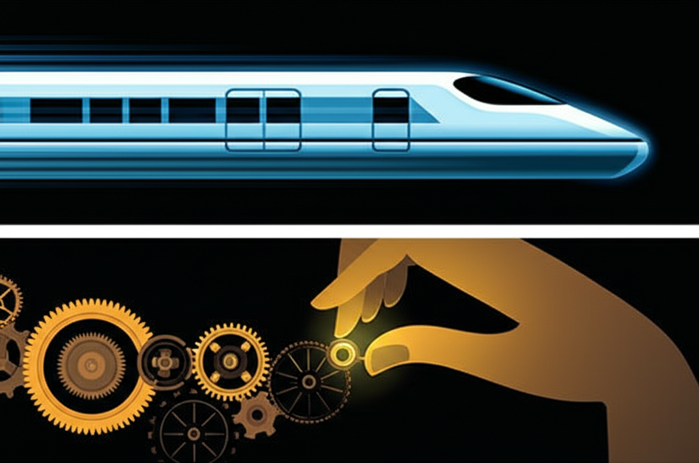
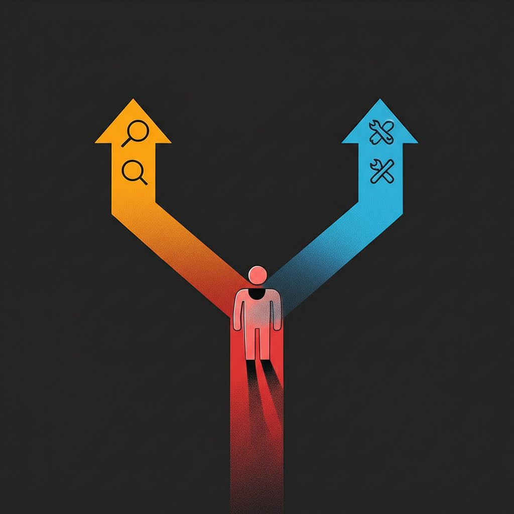

## 一个逐渐清晰的问题

最近在做一个基于 Agentic 架构的 AI 写作产品。整个产品建立在一个 Agentic 核心上——并行生成、记忆管理、工具调用、多步规划，所有上层功能都长在这个核心上面。

功能迭代很快。研发借助 Claude Code、Codex 等 AI 辅助工具，Agentic 核心几乎每天都在进化。新功能从想法到上线的周期被大幅压缩，这在过去是不可想象的。

但我逐渐注意到一个现象：**产品的功能在变强，效果优化的推进却在变慢。**

起初我以为是效率问题，后来才意识到这是一个结构性矛盾——功能和效果这两条线，天然就跑在不同的速度上，而且功能跑得越快，效果这边的处境就越难。

## 为什么速度差是结构性的

功能开发是**并行的、可堆叠的**。一个 Agentic 核心可以同时推进多个模块——记忆、工具、并行生成——各自独立开发，最后集成。在 AI 辅助编码的加持下，一个开发者一周能推进过去一个月的工作量。功能的产出速度已经被工具从根本上改变了。

效果优化是**串行的、需要深挖的**。每一个效果问题都要经历「修改提示词 → 等模型执行 → 观察输出 → 分析问题 → 再调整」的循环。AI 可以帮你写提示词，但这个循环里最耗时的部分——等待执行和观察分析——是压缩不了的。你总得看看模型实际输出了什么，才知道改得对不对。而且很多效果问题需要反复迭代，一轮调不到位就要再来一轮。

arXiv 上有篇研究 Cursor 的论文（[Speed at the Cost of Quality](https://arxiv.org/abs/2511.04427)）量化了一个类似的现象：AI 辅助编码让开发速度大幅提升，但代码质量的回归率也显著上升。工具加速了「做」的速度，但「做好」的速度没有同比提升。

我觉得这个结论可以直接平移到 AI 产品开发上。**功能的速度被工具改变了，效果的速度被本质决定了。** 这个差距不会因为团队更努力就消失，它是由两件事的内在性质决定的。

## 功能迭代在制造效果的问题

如果只是速度差，问题还不算太严重——效果慢一步，追着赶就是了。

真正让我觉得棘手的是另一件事：**功能迭代本身在不断扩大效果的问题空间。**

每加一个新功能，就多一个可能影响效果的变量。加了记忆模块，写作风格可能因为历史上下文的引入而漂移。加了并行生成，多路输出之间的一致性可能下降。加了工具调用，输出格式可能因为工具返回结果的差异而变得不可预测。

而且这些影响不是孤立的——它们互相叠加、互相耦合。记忆 + 并行的组合可能产生记忆单独不会有、并行单独也不会有的新问题。

更隐蔽的是，不需要大版本上线才出问题。**一个小的功能改动就可能引发效果漂移**，而且这种漂移经常是滞后发现的——测试的时候没看出来，上线跑了一阵子才在某些边界场景暴露。

大模型厂商自己也深受其害。ChatGPT 和 Claude 每次模型更新，用户社区就会出现一波「变笨了」的投诉。Anthropic 去年 9 月[公开承认](https://ai-engineering-trend.medium.com/claude-admits-model-quality-decline-but-users-arent-buying-it-08b34efb6be8)过 Haiku 3.5 和 Sonnet 4 在某段时间出现了质量下降，但他们强调「从未故意降低模型质量」——言下之意，漂移是底层变更的副作用，不是主观选择。Search Engine Land 的[基准测试](https://searchengineland.com/new-models-breaking-seo-workflows-465621)进一步验证了这个问题：新模型在通用能力上更强了，但在 SEO 这类特定任务上准确率反而降了。

**底层变了，上层的效果就不可预测。** 这个规律在模型层成立，在应用层同样成立。对我们来说，Agentic 核心就是「底层」，写作效果就是「上层」。核心每变一次，效果团队就面对一个新的、未知的环境。

所以效果团队面对的不只是「追赶速度差」，而是**在一个不断膨胀的问题空间里，用一个天然更慢的方法论去工作**。

## 被稀释的效果工作

理论上，效果团队的工作应该很纯粹：分析 badcase，调优提示词，提升输出质量。

但实际情况要复杂得多。

因为 Agentic 核心迭代快，功能稳定性本身就是个变量。效果团队在测试的过程中，会频繁撞到功能 bug——不是偶尔，而是常态。工作流变成了「测效果 → 撞到 bug → 判断归因 → 记录反馈 → 绕过去 → 继续测 → 又撞到 bug」的循环。

不会停下来等研发修 bug，但每次「撞→判断→绕」都有上下文切换的成本。更重要的是，**归因本身就是一件很耗精力的事。**

对 AI 理解深的人，可以比较快地判断「这是功能链路断了」还是「这是提示词的问题」。但团队里不是每个人都有这个判断力。特别是对 AI 了解不深的产品经理，他们面对的是一个包含意图理解、记忆检索、多步规划、并行生成、结果合并的复杂链路——当最终输出「不太对」的时候，到底是哪一步出了问题，很难靠直觉判断。

于是就会出现两种归因错误：

**把 bug 当效果问题。** 反复调提示词，怎么调都不对，折腾很久才发现根本是功能链路的问题。提示词没有任何问题，是数据没有正确传递，或者某个工具调用返回了异常结果。

**把效果问题当 bug。** 提给研发，研发排查半天回复「功能正常，这是模型行为」。双方都花了时间，问题还在原地。

这不是谁的能力问题。Agentic 系统的复杂度让「这到底是哪的问题」变成了一个需要跨领域知识的判断——你得同时理解功能链路和模型行为，才能准确归因。而在一个快速迭代的团队里，不可能要求每个人都具备这种跨领域的判断力。

**结果就是，效果团队在「优化效果 + 区分归因 + 反馈 bug」三件事之间反复横跳。** 真正用于深度效果优化的时间被持续压缩，而三件事的总量还在随着功能迭代持续增长。

## 一个还没爆发的风险

还有一个问题我觉得值得提前想。

功能上线是显性的——新功能、新界面、可以 demo、可以写进周报。效果优化是隐性的——「这批 case 的风格更自然了」或者「指令遵从度提升了 5%」，很难让没有直接参与的人产生直观感受。

当效果出了问题，因为归因困难，效果团队容易成为先被质疑的对象——「是不是你们的提示词没调好？」但实际上可能是功能变更引入的副作用。

当效果确实改善了，这个改善又很难被量化和展示。「写作风格更自然了」怎么证明？跟谁比？用什么指标？

这形成了一个不对称：**出了问题容易被归因到效果，做出改善又难以被看见。** 目前这个风险还没有显性化，但如果效果工作的价值持续不可见，资源分配就会倾斜，然后效果就真的追不上了。这是一个自我强化的恶性循环。

## 一些初步的思考

问题梳理到这里，我还没有成熟的解法，但有一些方向性的思考。

### 归因是第一个要解决的问题

在速度差和问题空间膨胀都难以改变的情况下，**降低归因成本可能是杠杆最大的切入点。**

Anthropic 的 [Agent Eval 文章](https://www.anthropic.com/engineering/demystifying-evals-for-ai-agents)里提到了 Descript 的做法，给了我一些启发。Descript 做 AI 视频编辑，他们把评估拆成三个层次：

- **Don't break things** — 功能有没有坏
- **Do what I asked** — 有没有按指令执行
- **Do it well** — 执行质量如何

这个分层看起来简单，但它解决了一个关键问题：**让归因有章可循，而不是依赖个人经验。** 第一层是 bug，后两层才是效果。如果团队能形成这样的判断习惯——先排除功能是否正常，再讨论效果好不好——归因效率会大幅提升。

更进一步，如果工具层面能自动记录每次请求的执行链路，归因就不再需要人去猜「到底是哪一步出了问题」，看数据就行。**把归因能力从人的经验转移到流程和工具上**，这是我觉得最值得投入的方向。

### 功能迭代需要某种形式的「刹车」

不是说要慢下来，而是需要一种机制，让功能的每次变更对效果的影响是可见的、可控的。

CodeScene 有篇关于 [Agentic AI 编码质量](https://codescene.com/blog/agentic-ai-coding-best-practice-patterns-for-speed-with-quality)的文章，提出了一个观点：在 AI agent 高速迭代的场景下，测试覆盖率应该当回归信号来用，而不是当虚荣指标。当覆盖率下降或行为检查失败，就是漂移的信号。

对应到我们的场景，这意味着需要一组效果基线——核心场景的「正常输出应该长什么样」。每次 Agentic 核心有变更，自动跑一遍，看看有没有搞坏已有效果。不需要覆盖全部场景，先覆盖最高频的就够。关键不是追求完美覆盖，而是建立一个**早期预警机制**——在效果团队手动发现问题之前，就能知道「这次改动可能有影响」。

同时，效果团队不应该靠自己去发现「底层又变了」。Agentic 核心的每次改动，影响范围应该是可查的、主动推送的。这不是信任问题，而是信息对称问题。

### 效果优化需要稳定的环境

有一个很朴素的观察：效果优化本质上是在做实验——改一个变量，观察结果。但如果实验环境本身在不断变化，实验结果就不可信。

这意味着效果优化需要某种形式的「稳定窗口」——一段 Agentic 核心不会变的时间，让效果团队能在一个确定的底盘上做深度调优。具体怎么实现可以有很多方式，核心思想是：**不是让功能停下来，而是让效果有一个「底盘不动」的工作环境。**

### 长期看，自动化评估是根本出路

Descript 的进化路径值得关注——他们从手动评估进化到 LLM-as-judge，用模型对输出做自动评分，定期跟人工校准。这意味着效果的初筛可以交给机器，人只负责深度分析和决策。

如果能走到这一步，效果优化的串行瓶颈就被打破了——不是让「改→等→看→分析」这个循环变快，而是让机器先跑一遍粗筛，人只介入需要判断的部分。

这是一个需要持续投入的方向，短期见效不大，但我觉得它是真正缩小速度差的路径。**不是让效果「追上」功能，而是改变效果优化的工作方式。**

## 写在最后

功能和效果是 AI 产品的双螺旋——缺一不可，但天然存在张力。

用户不会因为你的 Agent 能调用 10 个工具就满意，他们只关心最终拿到手的东西好不好用。但没有功能的持续迭代，效果优化就没有基础——你不可能在一个能力贫瘠的系统上调出好效果。

我目前的判断是：**这个矛盾没有银弹，但可以管理。**

承认速度差是结构性的，不幻想两条线跑一样快。用工具和流程降低归因成本，用回归测试让功能变更的影响可见，给效果留出稳定的工作环境，长期建设自动化评估能力。

这些思路大部分还在探索阶段，具体落地的效果还有待验证。但至少在问题层面，我觉得已经比较清晰了——**先看清矛盾的结构，才能找到管理它的方式。**

如果你也在做 Agentic AI 产品，大概率也在面对类似的问题。欢迎交流。
