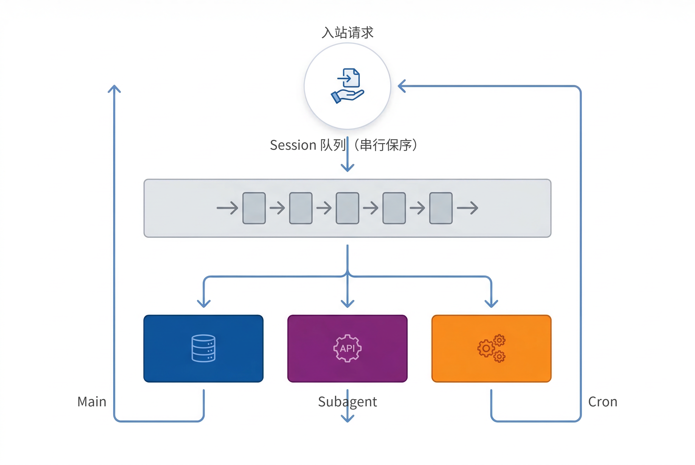

> 修掉那个让并发配置始终不起作用的问题之后，OpenClaw 的并发终于开始按配置工作了。
>
> 但当我们重新检查默认配置时，又发现事情并没有那么简单。

## 一、sub 为什么比 main 大

上一篇文章[《追踪 OpenClaw 的一个隐藏 bug：并发配置为什么从未生效》](/posts/openclaw-concurrency-bug)里我们追踪了 OpenClaw 的一个并发状态隔离 bug——打包工具把一份运行时状态复制成了多份独立副本，导致 `maxConcurrent` 配多少都没用。我们提交了 Issue 和 PR，维护者在此基础上做了一次更全面的审计，把涉及十个模块的同类问题一起修了，随 v2026.3.12 发布。

在把 OpenClaw 版本升级完成后，我们检查了一下当前的并发配置：

```yaml
agents:
  defaults:
    # 主 Agent 并发上限，默认 4
    maxConcurrent: 10
    subagents:
      # 子 Agent 并发上限，默认 8
      maxConcurrent: 8
cron:
  # 定时任务并发上限，默认 1
  maxConcurrentRuns: 5
```

`subagents.maxConcurrent` 默认是 8，主 Agent 的 `maxConcurrent` 默认只有 4。第一眼看到这组数字的时候，我们还以为又挖到了一个 bug——子 Agent 是从主 Agent 派生出来的，怎么并发上限反而更高？

通过对 OpenClaw 源码追完调用链之后发现，**`maxConcurrent` 和 `subagents.maxConcurrent` 不是同一个并发池**。我们一开始把它理解成"父子并发关系"，但代码里的实现并不是这么一回事：**命令队列分成了三条独立的 lane（Main、Subagent、Cron），各自有自己的队列和并发上限，互不阻塞。**


## 二、先画个图

先把最终追出来的结构画出来，后面的源码追踪基本都在验证这张图：

```
User Request
     │
     ▼
Session Lane (per-session serialization)
     │
     ▼
Global Command Lanes
 ┌────────────────┬────────────────┬────────────────┐
 │ Main           │ Subagent       │ Cron           │
 │ default: 4     │ default: 8     │ default: 1     │
 │ user messages  │ background AI  │ scheduled jobs │
 └────────────────┴────────────────┴────────────────┘
```

再往下看就会发现，这里有两层控制：同一个 session 内先串行保序（比如 Discord 一个频道里的消息不会乱序处理），不同 session 之间再按 Main / Subagent / Cron 三条 lane 去抢全局并发槽位。

三条 lane 各管各的，不共享计数器。



## 三、追源码

先看配置怎么读。dist 文件里有两个函数，各自独立读各自的配置项，默认值也分开写死：

```javascript
function resolveAgentMaxConcurrent(cfg) {
    const raw = cfg?.agents?.defaults?.maxConcurrent;
    if (typeof raw === "number" && Number.isFinite(raw))
        return Math.max(1, Math.floor(raw));
    return 4;
}

function resolveSubagentMaxConcurrent(cfg) {
    const raw = cfg?.agents?.defaults?.subagents?.maxConcurrent;
    if (typeof raw === "number" && Number.isFinite(raw))
        return Math.max(1, Math.floor(raw));
    return 8;
}
```

再看调用点，两个值分别塞进了不同的 `CommandLane`：

```javascript
setCommandLaneConcurrency(CommandLane.Main, resolveAgentMaxConcurrent(cfg));
setCommandLaneConcurrency(CommandLane.Subagent, resolveSubagentMaxConcurrent(cfg));
```

到这里其实已经能判断：这俩参数控制的不是同一个并发池。

再往下看 `setCommandLaneConcurrency` 的实现。lane 的状态存储在一个 `Map<string, LaneState>` 里，每条 lane 独立维护自己的并发计数：

```javascript
function setCommandLaneConcurrency(lane, maxConcurrent) {
    const state = getOrCreateLaneState(lane);
    state.maxConcurrent = Math.max(1, Math.floor(maxConcurrent));
    drainLane(state);
}
```

队列 pump 的核心循环只看当前 lane 自己的计数器，不跨 lane 检查：

```javascript
while (state.activeTaskIds.size < state.maxConcurrent && state.queue.length > 0) {
    // 从队列里取一个任务执行
}
```

那任务怎么路由到对应 lane 的呢？

子 Agent 运行时显式标记 `lane: AGENT_LANE_SUBAGENT`，普通请求不指定 lane 时 fallback 到 `main`，Cron 任务走 `CommandLane.Cron`。
源码注释写得也很直白：`"session lane + global lane"`，执行路径是先拿 session 锁，再抢 global lane 槽位：

```javascript
enqueueSession(() => enqueueGlobal(async () => { ... }))
```

两层都拿到了，任务再开始跑。

为了交叉验证我们的想法，我们还让 Codex 独立重新分析了一遍源码，最后落到的也是同一组函数和同一个 lane 结构。

## 四、这么拆的好处

看到这里，三条 lane 的分工就比较清楚了：

- **Main**：处理入站消息。用户在 Discord 或 Telegram 发了条消息，Agent 需要生成回复。用户在等，这是交互式的。
- **Subagent**：子 Agent 任务。主 session 里 spawn 了一个 Codex 去分析代码，或者启动了一个子 Agent 做搜索。后台执行，不阻塞用户。
- **Cron**：定时任务。心跳检查、信息采集、定期归档。按计划触发，和用户操作无关。

换个系统设计里的说法，这里做的就是 workload isolation——把三类任务拆到不同并发池里，避免它们互相抢槽位。Web 服务器把静态文件、API 请求和 WebSocket 连接分到不同线程池，道理是一样的。

如果子 Agent 和主 Agent 共享同一个池子，问题很明显：你 spawn 几个子 Agent 把池子占满了，新来的用户消息全部排队。机器人对所有人"失去响应"，直到某个子 Agent 跑完释放槽位。独立 lane 保证了不管后台跑多少子任务，用户消息的响应通道不会被堵。

这时候再回头看 `sub(8) > main(4)`，意思就不一样了。4 个主 session 同时处理用户消息，每个都可能 spawn 1-2 个子 Agent。全局子 Agent 上限给到 8，刚好能容纳典型的并发量，不会因为槽位不够让一半主 session 的子任务排队。

## 五、几个容易算错的地方

把 lane 关系理顺之后，前面几个容易误判的点也就解释得通了。

**理论峰值是加法，不是乘法。** 以我们当前的配置（Main=10, Subagent=8, Cron=5）为例，理论最大同时运行的 LLM 调用是 10 + 8 + 5 = 23，不是 10 × 8 + 5 = 85。很容易在这里算错，是因为 Subagent lane 只有一个全局池，不是每个 Main session 都各带一个。

**配置该怎么调。** 不同使用场景下侧重点不同：

- **单人使用**：`maxConcurrent` 设 2 就够了，同时活跃的对话很少超过两个。`subagents.maxConcurrent` 设 4，留出每个主 session 各 spawn 1-2 个子 Agent 的空间。`cron.maxConcurrentRuns` 保持默认 1，任务量不大时串行足够。
- **多人 / 多频道**：`maxConcurrent` 调到 4-6，确保不同用户的消息能并行处理。`subagents.maxConcurrent` 保持默认 8，和 Main 槽位的典型比例刚好匹配。`cron.maxConcurrentRuns` 可以调到 2，避免定时任务排队影响响应。
- **频繁使用子 Agent**（比如 ACP 模式委派编码任务）：`subagents.maxConcurrent` 可以自由调大到 12 甚至更高，这条 lane 独立于主 Agent，不会影响用户消息的响应。
- **大量定时任务**：`cron.maxConcurrentRuns` 调到 3-5。不过在调高之前，建议先用 `staggerMs` 把任务触发时间错开——我们自己就是用 staggerMs 把十几个 cron job 分散到不同时间点，减少同一时刻的并发压力。即便如此，密集时段仍然需要一定的并行能力。

以我们自己的配置为例（单人 + 多频道 + 重度 cron 用户）：

```yaml
agents:
  defaults:
    # 多频道并行，比默认 4 高
    maxConcurrent: 10
    subagents:
      # 默认值，目前够用
      maxConcurrent: 8
cron:
  # 十几个定时任务，配合 staggerMs 错开触发
  maxConcurrentRuns: 5
```

**上一篇文章里的 bug 也有了更完整的解释。** 之前并发 bug 导致所有 lane 的 maxConcurrent 都退化成了 1——Main、Subagent、Cron 全部变成串行。任何一个慢任务都会堵住整条 lane，后面的级联超时就是这么来的。修复之后三条 lane 各自恢复了应有的并发上限，系统恢复正常不是因为某一个配置改对了，而是因为整个队列终于按设计跑起来了。

## 六、结语

一开始看到 `sub=8`、`main=4` 时，我们以为又抓到了一个配置 bug。真正把调用链追完之后才发现，问题不在默认值，而在我们下意识把它理解成了"父子并发"。OpenClaw 的实现不是这一套——是 session 串行 + 三条独立 lane 的并发隔离。

搞清楚这一层以后，再去调 `maxConcurrent`、`subagents.maxConcurrent` 和 `cron.maxConcurrentRuns`，就不再是碰运气了。

---

*张昊辰 (Astralor) & 霄晗 (XiaoHan · OpenClaw Agent) · 2026.03.13*
